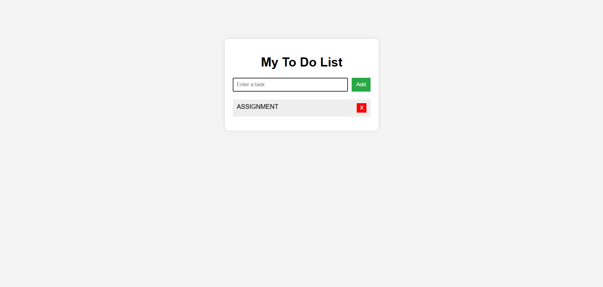

# Ex03 To-Do List using JavaScript
## Date:10/03/2025

## AIM
To create a To-do Application with all features using JavaScript.

## ALGORITHM
### STEP 1
Build the HTML structure (index.html).

### STEP 2
Style the App (style.css).

### STEP 3
Plan the features the To-Do App should have.

### STEP 4
Create a To-do application using Javascript.

### STEP 5
Add functionalities.

### STEP 6
Test the App.

### STEP 7
Open the HTML file in a browser to check layout and functionality.

### STEP 8
Fix styling issues and refine content placement.

### STEP 9
Deploy the website.

### STEP 10
Upload to GitHub Pages for free hosting.

## PROGRAM

### HTML

```
<!DOCTYPE html>
<html lang="en">
<head>
    <meta charset="UTF-8">
    <title>Simple To Do List</title>
    <link rel="stylesheet" href="style.css">
</head>
<body>

<div class="container">
    <h1>My To Do List</h1>

    <div class="input-section">
        <input type="text" id="taskInput" placeholder="Enter a task">
        <button onclick="addTask()">Add</button>
    </div>

    <ul id="taskList"></ul>
</div>

<script src="script.js"></script>
</body>
</html>
```

### CSS

```
body {
    font-family: Arial, sans-serif;
    background: #f4f4f4;
    display: flex;
    justify-content: center;
    margin-top: 100px;
}

.container {
    background: white;
    padding: 20px;
    width: 350px;
    border-radius: 10px;
    box-shadow: 0 0 10px rgba(0,0,0,0.1);
}

h1 {
    text-align: center;
}

.input-section {
    display: flex;
    gap: 10px;
}

input {
    flex: 1;
    padding: 8px;
}

button {
    padding: 8px 12px;
    background: #28a745;
    border: none;
    color: white;
    cursor: pointer;
}

button:hover {
    background: #218838;
}

ul {
    list-style: none;
    padding: 0;
    margin-top: 20px;
}

li {
    padding: 10px;
    background: #eee;
    margin-bottom: 10px;
    display: flex;
    justify-content: space-between;
    cursor: pointer;
}

.completed {
    text-decoration: line-through;
    color: gray;
}

.delete-btn {
    background: red;
    border: none;
    color: white;
    padding: 4px 8px;
    cursor: pointer;
}
```

### JS

```
function addTask() {

    let input = document.getElementById("taskInput");
    let taskText = input.value;

    if(taskText === ""){
        alert("Please enter a task");
        return;
    }

    let li = document.createElement("li");
    li.textContent = taskText;

    li.onclick = function(){
        li.classList.toggle("completed");
    };

    let deleteBtn = document.createElement("button");
    deleteBtn.textContent = "X";
    deleteBtn.className = "delete-btn";

    deleteBtn.onclick = function(){
        li.remove();
    };

    li.appendChild(deleteBtn);

    document.getElementById("taskList").appendChild(li);

    input.value = "";
}
```


## OUTPUT



## RESULT
The program for creating To-do list using JavaScript is executed successfully.
